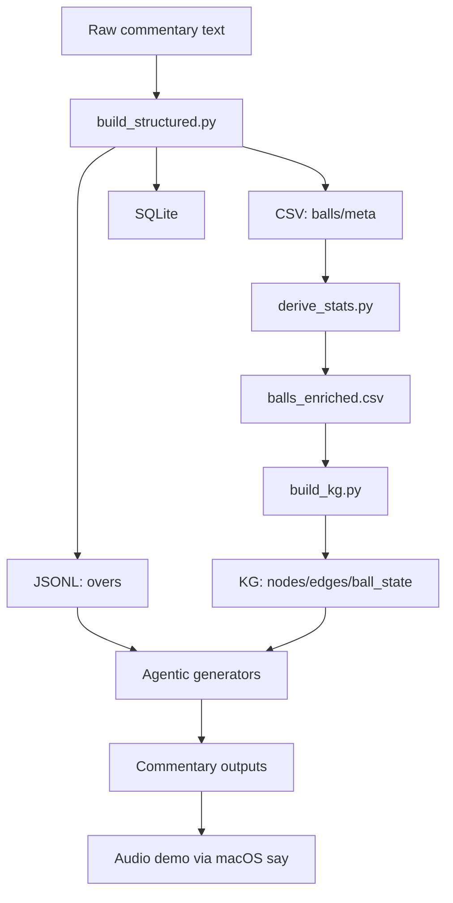
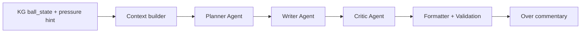

# Cri-CAN

Cricket Commentary Agentic Network (CWC 2011 Final). This repo turns Cricinfo-style ball-by-ball text into structured datasets, a match knowledge graph, and agentic commentary outputs (deterministic v0 + LLM-ready v1).

## How it works (flow)
At a high level we do: raw text -> structured data -> derived stats -> knowledge graph -> agentic commentary -> optional audio.



## Agent network + KG interaction
The working system is a sequential multi-agent pipeline: planner -> writer -> critic, with a formatting/validation guard at the end. The KG is used as score context (ball_state) and a pressure hint; it is injected into the writer and critic prompts so the output can mention momentum, required rate, and pressure without inventing facts.



If you want a more complex agent network (parallel voices, retrieval, or multi-modal), we can add more agents, but the current system is already end-to-end and reproducible.

## Output layout (hygienic)
All outputs live under one root:
- `Cri-CAN/agentic/outputs/autogen/`
- `Cri-CAN/agentic/outputs/crewai/`
- `Cri-CAN/agentic/outputs/longform/`
- `Cri-CAN/agentic/outputs/demo/llm_audio/`

## Demo outputs (latest)
From `agentic/outputs/demo/llm_audio/run_20260110_203938/demo_output.md`:

Example 1 (wicket_only, innings 1 over 6):
```
Previous over: End of over 6 - 8 off it. Boundaries from Dilshan kept it lively. A measured over with steady rotation. Over 7 begins. Wicket! Upul Tharanga departs, and Khan has the breakthrough. Sangakkara scores the first run off Zaheer by dabbing towards mid-on and setting off at top speed. Short ball and Dilshan swivels and pulls towards the fielder on the deep square leg boundary. Sangakkara strides forward and drives a length ball from outside off to the fielder at cover, nicely timed. Good ball from Khan, Sangakkara can't score. Short of a length and straight, Sangakkara gets behind the line and defends. End of over 7: 2 runs, 1 wicket (Upul Tharanga).
```
Audio: `agentic/outputs/demo/llm_audio/run_20260110_203938/wicket_only_innings1_over6.aiff`

Example 2 (boundary_four_only, innings 1 over 5):
```
Previous over: 0 off over 5. A measured over with steady rotation. Over 6 begins. That's 4! Dilshan finds the rope off Sreesanth. No run, tidy from Sreesanth. That's 4! Dilshan finds the rope off Sreesanth. Tighter line and length closer to off stump, Dilshan punches towards cover. Dot ball - Sreesanth keeps it tight. A touch slower and a lot straighter around middle and off, Dilshan tries to drive again but slices it towards point. End of over 6: 8 runs.
```
Audio: `agentic/outputs/demo/llm_audio/run_20260110_203938/boundary_four_only_innings1_over5.aiff`

Agentic LLM demo (AutoGen, funny, innings 2 over 4):
Output: `agentic/outputs/autogen/run_20260110_211629/autogen_innings2_over4.md`
```
Previous over: Over 3: 5 runs. Not bad for six deliveries. Not many fireworks outside the boundaries. Over 4 begins. Gambhir nudges a single off a full-length ball on off stump, keeping the scoreboard at 16/1 and the bowlers' nerves on the edge. Tendulkar swings again, threads the covers, adds two runs to make 18/1, and the crowd sighs in collective relief. A thunderbolt from Tendulkar, oh boy! He smashes four, pushing the score to 22/1, and the fielders are left chasing flies. Tendulkar plays a quiet ball, no runs, and Kulasekara stands firm at point, keeping wickets safe at 22/1. Another corker from Kulasekara sends Tendulkar weaving 4 runs, rallying the score to 26/1, while the bowlers stare at their mitts. Tendulkar takes a cautious ball, no runs, as Kulasekara bends one in from back of a length, sealing the over at 26/1. End of over 4: 11 runs.
```

Agentic LLM demo (AutoGen, serious, innings 2 over 4):
Output: `agentic/outputs/autogen/run_20260110_211951/autogen_innings2_over4.md`
```
Previous over: Over 3 yields 5. Minimal risk outside the scoring shots. Over 4 begins. Gambhir takes a single, a full-length ball on off stump, quietly pushes to mid-off for one. Tendulkar threads the covers for two runs, a dextrous shot that keeps the scoreboard ticking. Tendulkar hits a four, a clean boundary through the gully, adding four to the tally. No run as Kulasekara defends a delivery at point, a disciplined stroke that prevents any run. Tendulkar plays a four to mid-wicket, a precise shot that demonstrates his dominance. No run as Kulasekara pulls a short ball from the back of a length, the shot slipping past the keeper. End of over 4: 11 runs.
```

## Project layout
- `Cri-CAN/data/raw`: original commentary text files (immutable sources).
- `Cri-CAN/data/structured/csv`: `balls.csv`, `meta.csv`, `schema.md`.
- `Cri-CAN/data/structured/csv/balls_enriched.csv`: derived stats per ball.
- `Cri-CAN/data/structured/csv/qa_report.md`: QA checks for CSV data.
- `Cri-CAN/data/structured/jsonl`: `overs.jsonl`, `narrative.jsonl`, `schema.md`.
- `Cri-CAN/data/structured/sqlite`: `commentary.sqlite`, `schema.md`.
- `Cri-CAN/data/structured/legacy_csv`: legacy CSV output.
- `Cri-CAN/data/structured/report.md`: structured data performance report.
- `Cri-CAN/data/structured/kg`: knowledge graph outputs.
- `Cri-CAN/tools`: build + QA tooling.
- `Cri-CAN/agentic`: v0/v1 commentary pipelines and reports.
- `Cri-CAN/streamlit_app.py`: Streamlit UI for interactive commentary generation.
- `Cri-CAN/config.toml`: global configuration.
- `Cri-CAN/Makefile`: reproducible build/run targets.

## Data pipeline
1) Build structured datasets:
```bash
make -C Cri-CAN build
```
2) Derive stats + QA (CSV path):
```bash
make -C Cri-CAN derive
```
3) Build SQLite views:
```bash
make -C Cri-CAN sqlite-views
```
4) Build match KG:
```bash
make -C Cri-CAN kg
```

## Agentic commentary
### v0 deterministic (exact from parsed data)
- CSV:
```bash
make -C Cri-CAN agentic-csv
```
- SQLite:
```bash
make -C Cri-CAN agentic-sqlite
```
- JSONL:
```bash
make -C Cri-CAN agentic-jsonl
```
Outputs are labeled `v0-deterministic`.

### v1 human-style (LLM-ready)
```bash
make -C Cri-CAN agentic-jsonl-v1
```

Timepoint control:
```bash
python3 Cri-CAN/agentic/jsonl/run_agentic_v1.py --start 12.3 --end 14.6
python3 Cri-CAN/agentic/jsonl/run_agentic_v1.py --start 120 --limit 10
```

Recent overs context:
```bash
python3 Cri-CAN/agentic/jsonl/run_agentic_v1.py --context-overs 3 --limit 10
```

Ollama model override:
```bash
python3 Cri-CAN/agentic/jsonl/run_agentic_v1.py --model gpt-oss:20b --limit 10
```

### Commentary CLI (chunked output)
```bash
python3 Cri-CAN/agentic/commentary_cli.py --innings 2 --over 10 --style energetic
python3 Cri-CAN/agentic/commentary_cli.py --team IND --event boundary --style funny
python3 Cri-CAN/agentic/commentary_cli.py --bowler Malinga --over 20 --style serious
```

Modes:
- `--mode deterministic` (exact, per-ball)
- `--mode template` (template per-ball)
- `--mode llm` (LLM per-ball)
- `--granularity over` (smooth over summary, template or LLM)
- `--over-format ball` (ball-by-ball, no summary)
- `--over-format ball+summary` (ball-by-ball plus end-of-over summary)
- Style `panel` switches style per ball dynamically.

### Long-form over commentary
```bash
python3 Cri-CAN/agentic/longform/run_longform_over.py --innings 2 --over 4 --style broadcast
```
Outputs:
- `Cri-CAN/agentic/outputs/longform/run_YYYYMMDD_HHMMSS/longform_inningsX_overY.md`

## Match knowledge graph (KG)
Built from `balls_enriched.csv` into:
- `Cri-CAN/data/structured/kg/nodes.csv`
- `Cri-CAN/data/structured/kg/edges.csv`
- `Cri-CAN/data/structured/kg/ball_state.csv`

KG schema:
- `Cri-CAN/data/structured/kg/schema.md`

## LLM agent pipelines (CrewAI / AutoGen)
Install and run using the separate agents venv (Python 3.11):
```bash
python3.11 -m venv Cri-CAN/.venv-agents
Cri-CAN/.venv-agents/bin/python -m pip install crewai==0.11.2 pyautogen==0.2.0
```

CrewAI:
```bash
Cri-CAN/.venv-agents/bin/python Cri-CAN/agentic/crewai/run_crewai_over.py --innings 2 --over 4 --style broadcast
```

AutoGen:
```bash
Cri-CAN/.venv-agents/bin/python Cri-CAN/agentic/autogen/run_autogen_over.py --innings 2 --over 4 --style broadcast
```

Outputs:
- `Cri-CAN/agentic/outputs/crewai/`
- `Cri-CAN/agentic/outputs/autogen/`

Comparison report:
```bash
cat Cri-CAN/agentic/agents_compare.md
```

## Streamlit UI
```bash
Cri-CAN/.venv/bin/python -m streamlit run Cri-CAN/streamlit_app.py --server.headless true
```
Then open `http://localhost:8501` in your browser.

## Applications
- Live-style commentary generation from ball-by-ball feeds.
- Retrieval-based highlight clips (timepoint control + event filters).
- Analytics dashboards (over totals, partnerships, wickets, boundaries).
- Training/evaluation dataset for sports-commentary models.
- Broadcast tooling: style variants and tone control.

## Reference docs
- End-to-end walkthrough: `Cri-CAN/README_GLOBAL.md`
- Performance report: `Cri-CAN/agentic/performance_report.md`

## Requirements + setup
- Python 3.11+ (stdlib only).
- Optional: Ollama for local LLM generation.
- Optional: Streamlit (installed in local venv at `Cri-CAN/.venv`).

Config:
- Default config: `Cri-CAN/config.toml`
- Override with `CRI_CONFIG` or `--config /path/to/config.toml`.

Key LLM settings in config:
- `llm.command_template = "ollama run {model}"`
- `llm.model = "gpt-oss:20b"`
- `llm.multimodal_model = "gemma3:27b"`

LLM usage (Ollama):
- Default command: `ollama run {model}`
- Set `llm.model` to `gpt-oss:20b` for text generation.
- `llm.multimodal_model` is reserved for later audio/video use.
- The adapter cleans any preamble (e.g., "Thinking...") and keeps only the final line.

LLM demo audio (5 diverse overs):
```bash
python3 Cri-CAN/tools/generate_llm_over_demo.py --match CWC_2011_final_ALL
```
Outputs:
- `Cri-CAN/agentic/outputs/demo/llm_audio/run_YYYYMMDD_HHMMSS/demo_output.md`
- `Cri-CAN/agentic/outputs/demo/llm_audio/run_YYYYMMDD_HHMMSS/*.aiff`

## GitHub
Repo: https://github.com/Vik-u/Cri-CAN.git
