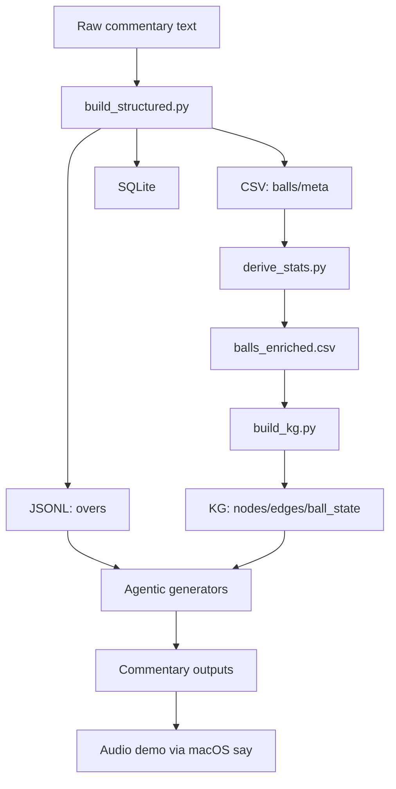
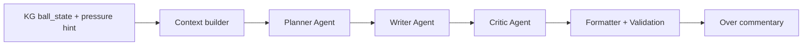

# Cri-CAN End-to-End Guide

This document captures the full flow from raw files to structured data, knowledge graph, and agentic commentary, with how the agents interact and where outputs land.

## System flow overview


## Agent network + KG interaction
The core agentic pipeline is a sequential multi-agent flow: planner -> writer -> critic -> formatter. The KG adds per-ball score context and a pressure hint, which are injected into the writer and critic prompts.



## 1) Raw data intake
- Location: `Cri-CAN/data/raw`
- Files are Cricinfo-style ball-by-ball text.
- Source files are kept immutable and only read by tooling.

## 2) Structured outputs
Generated by `Cri-CAN/tools/build_structured.py`.

Outputs:
- CSV: `Cri-CAN/data/structured/csv/balls.csv`, `Cri-CAN/data/structured/csv/meta.csv`, `Cri-CAN/data/structured/csv/schema.md`
- JSONL: `Cri-CAN/data/structured/jsonl/overs.jsonl`, `Cri-CAN/data/structured/jsonl/narrative.jsonl`, `Cri-CAN/data/structured/jsonl/schema.md`
- SQLite: `Cri-CAN/data/structured/sqlite/commentary.sqlite`, `Cri-CAN/data/structured/sqlite/schema.md`
- Structured report: `Cri-CAN/data/structured/report.md`

## 3) Derived stats + QA (CSV path)
Generated by `Cri-CAN/tools/derive_stats.py`.

Outputs:
- Enriched CSV: `Cri-CAN/data/structured/csv/balls_enriched.csv`
- QA report: `Cri-CAN/data/structured/csv/qa_report.md`

Enriched fields include:
- `innings_runs`, `innings_wickets`, `innings_legal_balls`, `innings_overs`
- `crr` (current run rate)
- `target_runs`, `runs_remaining`, `balls_remaining`, `rrr` (required run rate)
- `phase` (powerplay/middle/death)
- `event_type`, `is_extra`, `is_boundary`, `is_legal_ball`

## 4) SQLite query layer
Created by `Cri-CAN/tools/build_sqlite_views.py` using `Cri-CAN/tools/sqlite_views.sql`.

Views:
- `ball_summary`, `wickets`, `boundaries`, `extras`
- `over_summaries`, `over_totals`, `partnerships`

Query helper:
- `Cri-CAN/tools/query_sqlite.py` (basic CLI query interface)

## 5) Match knowledge graph (KG)
Built by `Cri-CAN/tools/build_kg.py`.

Outputs:
- `Cri-CAN/data/structured/kg/nodes.csv`
- `Cri-CAN/data/structured/kg/edges.csv`
- `Cri-CAN/data/structured/kg/ball_state.csv`
- `Cri-CAN/data/structured/kg/schema.md`

## 6) Agentic commentary
There are two modes:

### v0 (deterministic)
- CSV: `Cri-CAN/agentic/csv/run_agentic_csv.py`
- SQLite: `Cri-CAN/agentic/sqlite/run_agentic_sqlite.py`
- JSONL: `Cri-CAN/agentic/jsonl/run_agentic_jsonl.py`

Output is labeled `v0-deterministic` and is derived directly from parsed commentary.

### v1 (LLM-ready, human-style)
- JSONL: `Cri-CAN/agentic/jsonl/run_agentic_v1.py`
- Agents: `Cri-CAN/agentic/agents.py` (PlannerAgent, StyleAgent, FactCheckAgent)
- Prompts: `Cri-CAN/agentic/jsonl/prompts/system.txt`, `Cri-CAN/agentic/jsonl/prompts/user.txt`

### Commentary CLI (chunked output)
- CLI: `Cri-CAN/agentic/commentary_cli.py`
- Filters by over, bowler, batsman, team, innings, and event type.
- Style controls: broadcast, funny, serious, methodical, energetic, roasting.
- Modes: deterministic, template, llm.
- Granularity: per-ball or per-over (smooth summary).
- Panel style switches voice per ball dynamically.
- Over output formats: summary, ball, ball+summary.

### Long-form over commentary
- `Cri-CAN/agentic/longform/run_longform_over.py`
- Uses KG-derived `ball_state.csv` when present.
- Output: `Cri-CAN/agentic/outputs/longform/run_YYYYMMDD_HHMMSS/longform_inningsX_overY.md`

## 6b) LLM agent frameworks (CrewAI / AutoGen)
Two separate folders are provided for framework comparison:
- `Cri-CAN/agentic/crewai`
- `Cri-CAN/agentic/autogen`

Install the agents venv:
```bash
python3.11 -m venv Cri-CAN/.venv-agents
Cri-CAN/.venv-agents/bin/python -m pip install crewai==0.11.2 pyautogen==0.2.0
```

CrewAI run:
```bash
Cri-CAN/.venv-agents/bin/python Cri-CAN/agentic/crewai/run_crewai_over.py --innings 2 --over 4 --style broadcast
```

AutoGen run:
```bash
Cri-CAN/.venv-agents/bin/python Cri-CAN/agentic/autogen/run_autogen_over.py --innings 2 --over 4 --style broadcast
```

Outputs:
- `Cri-CAN/agentic/outputs/crewai/`
- `Cri-CAN/agentic/outputs/autogen/`

Comparison report:
```bash
cat Cri-CAN/agentic/agents_compare.md
```

### Streamlit UI
- App: `Cri-CAN/streamlit_app.py`
- Run: `Cri-CAN/.venv/bin/python -m streamlit run Cri-CAN/streamlit_app.py --server.headless true`
- Open: `http://localhost:8501`

Features:
- Conversational tone (broadcast style)
- Timepoint control: `--start`, `--end`, `--limit`
- Retrieval of recent overs for context
- LLM hook with fallback style templates

## 7) LLM integration (Ollama)
Configuration is in `Cri-CAN/config.toml`:
- `llm.command_template = "ollama run {model}"`
- Text model: `llm.model = "gpt-oss:20b"`
- Multimodal model placeholder: `llm.multimodal_model = "gemma3:27b"`

The adapter reads a prompt from stdin and expects a single-line response. If LLM output contains preambles, it is cleaned before use.

## 7b) LLM over demo + audio
Generate five diverse overs (wicket, boundary, both, 4s, 6s) and audio via macOS `say`:
```bash
python3 Cri-CAN/tools/generate_llm_over_demo.py --match CWC_2011_final_ALL
```
Outputs are written to `Cri-CAN/agentic/outputs/demo/llm_audio/run_YYYYMMDD_HHMMSS`.

## 8) Text first, then audio/video
Text is the baseline for correctness. Recommended flow:
1) Finalize text outputs (v0 + v1)
2) Add timing cues
3) Align to audio/video

You can start audio/video work in parallel, but it should consume validated text output.

## 9) Where to look next
- Text agent output: `Cri-CAN/agentic/jsonl/sample_output_v1.txt`
- Deterministic output: `Cri-CAN/agentic/jsonl/sample_output.txt`
- QA report: `Cri-CAN/data/structured/csv/qa_report.md`
- SQLite views: `Cri-CAN/tools/sqlite_views.sql`
- KG schema: `Cri-CAN/data/structured/kg/schema.md`
- Long-form output: `Cri-CAN/agentic/outputs/longform`

## Requirements + setup
- Python 3.11+ (stdlib only).
- Optional: Ollama for local LLM generation.
- Optional: Streamlit (installed in local venv at `Cri-CAN/.venv`).

Global config: `Cri-CAN/config.toml`

Make targets:
- `make -C Cri-CAN build`
- `make -C Cri-CAN derive`
- `make -C Cri-CAN sqlite-views`
- `make -C Cri-CAN kg`
- `make -C Cri-CAN agentic-csv`
- `make -C Cri-CAN agentic-jsonl-v1`
- `make -C Cri-CAN compare`
